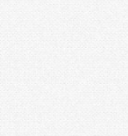

# LT 大会用スライド

タイトル

---
layout: intro
---

## 自己紹介

  

    
<strong>名前:</strong> 

    
<strong>役職:</strong> 

    
<strong>趣味:</strong> 

  

  

    
  

---
layout: section
---

## 今日の発表について

  <ol class="text-2xl space-y-4">
    <li>A</li>
    <li>B</li>
    <li>C</li>
  </ol>

---
layout: default
---

## A

  hogehoge

---
layout: default
---

## B

  fugafuga

---
layout: default
---

## C

  piyopiyo

